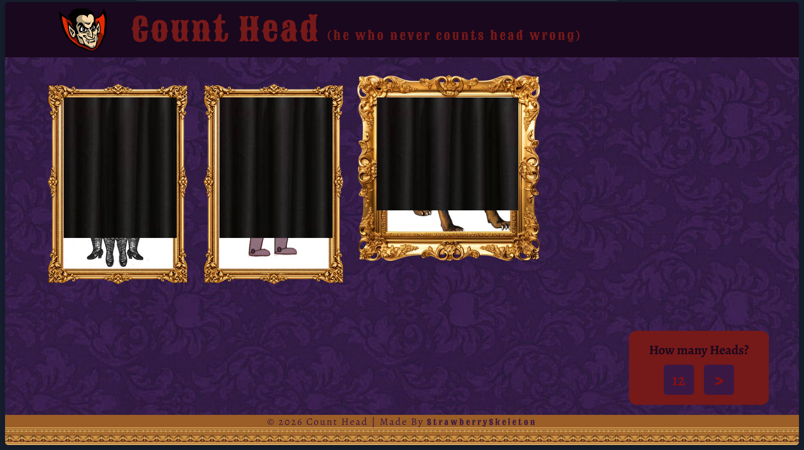

# Count Head

you are count count head, he who never counts heads wrong. on your castle wall, there are portraits of some "people" and you have to count the number of heads correctly.

> click anywhere first to start the bg music

## Features
- count head's castle theme
- sound effects (bg music, win and lose effects)
- made by me, no ai!!
- responsive

#### Tools Used
- HTML5
- CSS3
- Vanilla JS
- VS Code (with live server extension) for coding

## Screenshots
project screenshot

## Run Locally
1. Clone this repo or download zip file from github
2. Open `index.html` in your browser

## Credits
- made by me
- assets used: (pinterest)
> https://in.pinterest.com/pin/1148277236223895651/
> https://in.pinterest.com/pin/175781191697460390/
> https://in.pinterest.com/pin/239113061462841737/
> https://in.pinterest.com/pin/602567625186190163/
> https://in.pinterest.com/pin/31314159904899152/
- color palette: [pinterest](https://in.pinterest.com/pin/1148277236223895651/)
- sound effects: (pixabay)
> https://pixabay.com/users/mfcc-28627740/?utm_source=link-attribution&utm_medium=referral&utm_campaign=music&utm_content=597345
> https://pixabay.com/users/dragon-studio-38165424/?utm_source=link-attribution&utm_medium=referral&utm_campaign=music&utm_content=431486
> https://pixabay.com/users/universfield-28281460/?utm_source=link-attribution&utm_medium=referral&utm_campaign=music&utm_content=121085

> AI USAGE
> some minor debugging (like footer disappearing, sound not playing, etc.)
> tried to make a responsive masony layout for any random number of elements initially, didn't work so just used a flex box and flex wrap for the img frames layout

## MIT License
Copyright 2026 Strawberry Skeleton

Permission is hereby granted, free of charge, to any person obtaining a copy of this software and associated documentation files (the “Software”), to deal in the Software without restriction, including without limitation the rights to use, copy, modify, merge, publish, distribute, sublicense, and/or sell copies of the Software, and to permit persons to whom the Software is furnished to do so, subject to the following conditions:

The above copyright notice and this permission notice shall be included in all copies or substantial portions of the Software.

THE SOFTWARE IS PROVIDED “AS IS”, WITHOUT WARRANTY OF ANY KIND, EXPRESS OR IMPLIED, INCLUDING BUT NOT LIMITED TO THE WARRANTIES OF MERCHANTABILITY, FITNESS FOR A PARTICULAR PURPOSE AND NONINFRINGEMENT. IN NO EVENT SHALL THE AUTHORS OR COPYRIGHT HOLDERS BE LIABLE FOR ANY CLAIM, DAMAGES OR OTHER LIABILITY, WHETHER IN AN ACTION OF CONTRACT, TORT OR OTHERWISE, ARISING FROM, OUT OF OR IN CONNECTION WITH THE SOFTWARE OR THE USE OR OTHER DEALINGS IN THE SOFTWARE.